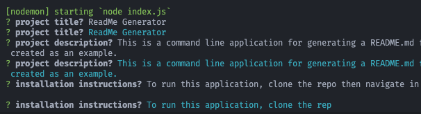

 
<h1> ReadMe Generator </h1>

 This is a Node.js application that utilizes the Inquirer package for generating README.md files. Answer a series of questions and the application will format then generate a newREADME.md file in the project directory from the command line interface. 

<h2> Table of Contents </h2>

Contents

<ol>
<li><a href="#installation">Installation</a></li>
<li><a href="#usage">Usage</a></li>
<li><a href="#contributors">Contributors</a></li>
<li><a href="#tests">Tests</a></li>
<li><a href="#questions">Questions</a></li>

<h3 id='installation'>Installation</h3>

To run this application, clone the repo then navigate in a terminal to the root directory of the repo. install packages using the command "npm install"

<h3 id='usage'>Usage</h3>

start the application with the command "node index.js" and follow the prompts in the console.

<h3 id='contributors'>Contributors</h3>

<h3 id='tests'>Tests</h3>

<h3 id='questions'>Questions</h3>

 | Contact me | 

 Github: bSandfer 

 Email: bsandfer@gmail.com 

